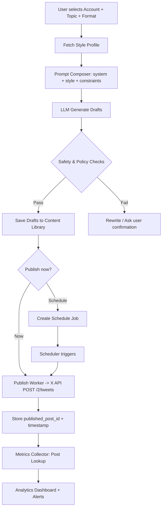
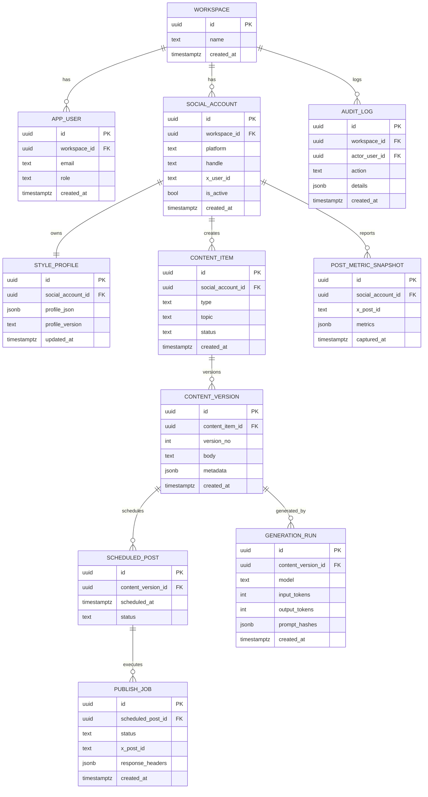

# XPatla Benzeri Bir Ürünü Kişisel Kullanım İçin İnşa Etme ve Ürünleştirme Ana Planı

## Yönetici özeti

XPatla, “AI’nin yazı stilini öğrenmesi (style cloning)”, stiline uygun “tweet/thread/reply üretimi”, “quote/reply önerileri”, “hesap/rekabet analizi”, “AI koç”, “çoklu hesap yönetimi” ve kredi bazlı kullanım gibi bileşenleri tek bir büyüme panelinde birleştiren bir X (Twitter) büyüme aracıdır. Ürün; kullanıcı adını girerek public tweet’leri analiz ettiğini, ardından kullanıcının “sesini” (vocabulary/humor dahil) öğrendiğini ve “viral potansiyeli yüksek” içerik üretip “optimal saatlerde” paylaşmaya yardımcı olduğunu iddia eder. citeturn2view0

Kişisel kullanım için “aynısını” yapmak, iki ana parçaya indirgenebilir:  
Birincisi **kişisel içerik copilot’u** (stil çıkarımı + içerik üretimi + kütüphane + takvim). İkincisi **ölç-öğren döngüsü** (performans metriklerinin toplanması, ilk saatlerde hızlı feedback, içerik stratejisi ve A/B varyant denemeleri). Akademik bulgular, tweet’lerin etki “zirvesinin” çok hızlı geldiğini (ör. ilk dakikalar/saatler) ve 24 saat sonra çoğu tweet’in neredeyse hiç yeni impression üretmediğini gösterir; bu da “yayın sonrası hızlı gözlem ve iterasyon”u ürün tasarımının merkezine koymayı mantıklı kılar. citeturn3academia16

Ürünleştirme (SaaS) ayağında, **çoklu hesap + ekip iş akışı + onay süreçleri + kredi/planlar + güvenlik & uyum** gereksinimleri belirleyici olur. X Developer Platform tarafında: X API artık **pay-per-usage (kredi bazlı)** ve **per-endpoint fiyatlandırma** ile çalışır; kullanım, Developer Console’dan izlenir ve krediler tüketimle düşer. citeturn7view1turn30view2 Ayrıca endpoint bazlı **rate limit** tabloları ve “429 Too Many Requests” davranışı çok net olduğu için entegrasyonun güvenli/uyumlu tasarlanması şarttır. citeturn7view0turn31view0

Bu rapor, önce XPatla eşdeğerinin ürün tanımını ve rekabeti netleştirir; sonra MVP kapsamını (user story + acceptance criteria), 7/30 günlük uygulama planını ve eksiksiz teknik mimariyi (mermaid diyagramlar dahil) verir. Son bölüm; prompt engineering, model seçimi ve maliyet hesapları, X API entegrasyonu (OAuth2 PKCE), otomasyon/uyum riskleri, güvenlik ve veri saklama politikaları, test planı, ekip/bütçe, GTM ve KPI panolarını kapsar.

## Ürün tanımı ve çekirdek özellikler

XPatla’nın kamuya açık vaat ettiği özellikleri, eşdeğer ürün tanımı çıkarmak için güçlü bir referanstır: “Style Cloning”, “Tweet Generator”, “Thread Builder”, “Quote Suggestions”, “Reply Suggestions”, “Account Analysis”, “AI Coach” ve “Multi Account (10’a kadar)” gibi modüller açıkça listelenir. citeturn2view0 Aynı sayfa, Lite/Pro/Team planlarını kredi bazlı bir sistemle paketlediğini ve Stripe ile ödeme aldığını belirtir. citeturn2view0

Kişisel kullanım için eşdeğer ürün tanımı (önerilen): **“Kendi yazı stilimde, hedef kitlem ve nişim için X içeriklerini planlayan, üreten, iyileştiren ve performansını ölçen kişisel X Growth OS.”**

Çekirdek özellikler, hem kişisel kullanım hem ürünleştirme hedefi için şu domain’lere ayrılmalı:

**Stil çıkarımı ve style cloning**  
Kullanıcının X’teki son N gönderisini (ör. /2/users/:id/tweets) çekip, dil/ton/uzunluk/emoji/argo/CTA kalıpları, hook tipleri ve cümle ritmini çıkararak bir “Style Profile” üretmek. XPatla, “AI analyzes your tweets, learns your writing style, vocabulary, and humor” diye tanımlar. citeturn2view0 Timelines endpoint’i; “User Posts timeline” ile “3,200 en yeni post” gibi sınırlar ve filtreleme (retweets/replies exclude) sunduğundan stil verisini kontrollü çekmeye uygundur. citeturn11view0

**AI içerik üretimi**  
XPatla’nın format yaklaşımı (“Micro to Thunder gibi formatlar”) ürünleştirme açısından değerlidir çünkü kullanıcı, “konu + format” seçerek üretim yapar. citeturn2view0 Eşdeğer tasarımda içerik türleri:

- Micro tweet (tek fikir)
- Hook + value + CTA tweet
- Thread (3/5/10)
- Quote tweet önerisi (viral tweet’lere bağlanma)
- Reply önerisi (otorite/katma değer)
- “AI Coach” sohbeti (strateji + fikir bankası)

**İçerik kütüphanesi ve yeniden kullanım**  
Tweet Hunter “2M viral tweets library” gibi kütüphane vaadiyle konumlanır; bu, “ilham kütüphanesi + swipe file” modülünün pazarda kritik olduğunu gösterir. citeturn27view0 Kişisel üründe bu kütüphane; kendi tweet’lerin + kaydettiğin örnekler + niş rakip tweet’lerinden oluşabilir (kendi veri havuzun).

**Analitik ve öğrenme döngüsü**  
XLab, “real-time metrics that matter” ve “analytics 7-day/60-day/unlimited” gibi katmanlarla analitiği plana bağlar. citeturn24view0 X API tarafında “engagement metrics including impressions, likes, reposts, replies…” gibi metriklere erişim olduğuna dair resmi dokümantasyon bulunur. citeturn8view2 Ayrıca Post Lookup, “Analytics — Retrieve engagement metrics for specific Posts” kullanımını açıkça listeler. citeturn10view0  
Önemli ürün içgörüsü: Tweet’in “yarı ömrü” çok kısa olabilir; bu nedenle dashboard “ilk 15/60/180 dakika” penceresinde performans uyarıları ve hızlı iterasyonu desteklemelidir. citeturn3academia16

**Scheduler ve queue**  
Typefully, zamanlama + slot tabanlı planlama + “en iyi zamanı önerme” gibi işlevleri vurgular. citeturn28view1 TweetHunter da “tweet and thread scheduling”, “evergreen tweets”, “thread delay” gibi otomasyonlarla öne çıkar. citeturn27view0 X API’da post yaratma endpoint’i (POST /2/tweets) resmi olarak sağlanır. citeturn9view0

**Rakip analizi ve “steal their strategy”**  
XPatla “Analyze any account… what works? Steal their strategy.” yaklaşımını “Account Analysis” altında konumlar. citeturn2view0 Kişisel ürün için bunun sade hali: 10–30 rakip hesap seç, son 30 gün içerik türü/uzunluk/konu/etkileşim paterni çıkar, “en iyi hook kalıpları”nı ve posting saatlerini raporla.

**Multi-account yönetimi ve ürünleştirme gereği**  
XPatla “Connect 10 accounts” ve “Multi Account” modülünü çekirdek özellik yapar. citeturn2view0 TweetHunter da “Add unlimited Twitter accounts” der. citeturn27view0 SaaS’a evrildiğinde çoklu hesap; tenant izolasyonu, token şifreleme, rol yönetimi ve limit/uyum katmanlarını zorunlu kılar.

**Growth loops (viral döngüler)**  
Pazardaki araçlar, ürün içi büyüme döngülerini genellikle şu noktalara kurar:

- “Shareable analytics profile” (TweetHunter: “Share your stats publicly…”) citeturn27view0
- Referral kredi/bonus (Postwise, “free credits… referring a friend”) citeturn29view0
- Community (XPatla: Telegram community) citeturn2view0
- “Built with …” etiketi / showcase (ürün kanalı)

## Rekabet ortamı ve karşılaştırmalı tablo

Aşağıdaki tablo, XPatla ile aynı probleme oynayan en az 6 aracı (benzerlik: X odaklı içerik üretimi/scheduler/analitik/growth) resmi sayfalarındaki bilgilerle karşılaştırır. Fiyatlar zamanla değişebilir; burada kaynaklarda görünen güncel/ifşa edilen değerler baz alınmıştır.

| Araç             | Temel vaat / öne çıkan özellik                                                                              |                                                                            Fiyat başlangıç (aylık) | Hedef kullanıcı                                                          | Artılar                                                                                         | Eksiler                                                                            | Resmi kaynak                   |
| ---------------- | ----------------------------------------------------------------------------------------------------------- | -------------------------------------------------------------------------------------------------: | ------------------------------------------------------------------------ | ----------------------------------------------------------------------------------------------- | ---------------------------------------------------------------------------------- | ------------------------------ |
| **XPatla**       | Style cloning, tweet/thread/reply üretimi, quote/reply önerileri, account analysis, AI Coach, multi-account |             **$16/mo** (Lite; yıllık faturalı), Pro **$41/mo**, Team **$124/mo** citeturn2view0 | X’te viralleşmek isteyen creator’lar, growth odaklı hesaplar             | Stil klonlama + engagement (reply/quote) odaklı paket; 10 hesap bağlama citeturn2view0       | Kredi sistemi ve planlar yıllık faturalı; “nasıl çalışıyor” kapalı kutu            | citeturn2view0              |
| **Tweet Hunter** | 2M viral tweet kütüphanesi, scheduling, evergreen, Auto-DM/plug/retweet, AI writer, CRM                     | **$29/mo** (Discover), **$49/mo** (Grow), Enterprise **$199.99/mo** citeturn27view0turn27view1 | X’te içerik+automation ile büyümek isteyen creator/marketer              | Büyük “viral library”; otomasyon + CRM; sınırsız hesap ekleme citeturn27view0                | Agresif otomasyon özellikleri uyum riskini artırabilir (spam/duplicate/DM)         | citeturn27view0turn27view1 |
| **Hypefury**     | Scheduling + autopost/cross-post, viral thread hooks/templates, Auto-DM, engagement builder, analytics      |          **$29/mo** Starter; Creator **$65**, Business **$97**, Agency **$199** citeturn20view1 | Creator, girişimci, multi-platform sosyal büyüme                         | Plan/fonksiyon matrisi ayrıntılı; çoklu platform; analytics katmanlı citeturn20view1         | X’e özel “style cloning” vurgusu daha zayıf; otomasyon yine uyum hassas            | citeturn20view1             |
| **Typefully**    | Thread editor, scheduling, analytics, prompts; planla büyü                                                  |                          Starter **$8/mo**, Creator **$19/mo**, Team **$39/mo** citeturn28view1 | Thread ağırlıklı yazan creator’lar, “distraction-free writing” arayanlar | Yazım deneyimi güçlü; uygun giriş fiyatı; analytics vurgusu citeturn28view1                  | Resmi pricing sayfası JS ağırlıklı; AI growth “coach” daha sınırlı                 | citeturn28view1             |
| **Postwise**     | AI ile viral içerik, scheduling, analytics; çoklu platform                                                  |                         Basic **$37/mo**, Boss **$59/mo**, Unlimited **$97/mo** citeturn26view0 | “AI ghostwriter + scheduler” isteyen creator/ekip                        | Planlar net; “Advanced Analytics Dashboard”; “Custom AI Training” üst planda citeturn26view0 | Kredi mantığı (1 kredi = 1 AI tweet) üretim yaklaşımını etkiler citeturn29view0 | citeturn26view0turn29view0 |
| **XLab**         | Hook scoring (önce/sonra), Content Lab, analytics katmanları, queue slots                                   |                                     Free; Creator **$19/mo**, Growth **$49/mo** citeturn24view0 | Hook/optimizasyon odaklı creator’lar                                     | “Hook’u yayınlamadan analiz etme” net ürün farkı citeturn24view0                             | Kütüphane/CRM kadar kapsamlı değil; AI kredi limitleri plan bağımlı                | citeturn24view0             |

Rekabetten çıkarım: Pazar iki ana kümeye ayrılıyor. Birinci küme **“style+viral+reply/quote”** (XPatla) gibi doğrudan büyüme taktikleriyle “X algoritmasını” hedefliyor. İkinci küme **“writer experience + scheduler + analytics”** (Typefully) veya **“automation & growth ops”** (TweetHunter/Hypefury) ekseninde ilerliyor. Mimariyi tasarlarken, kişisel kullanım MVP’si için **writer+style+schedule+fast analytics** seti en yüksek kaldıraç.

## MVP kapsamı, kullanıcı hikâyeleri ve uygulama yol haritası

### Önceliklendirilmiş MVP kapsamı

MVP’yi “kişisel kullanım” ve “ürünleştirmeye hazır çekirdek” olarak iki katmanda düşünmek en hızlı ilerleyen modeldir:

**MVP-0 (kişisel)**: Tek kullanıcı, 1–2 X hesabı

- X OAuth2 PKCE ile bağlanma (manuel post + “schedule draft”)
- Timelines’tan tweet çekip style profile çıkarma citeturn11view0turn13view0
- Tweet/Thread taslak üretimi (format şablonları)
- İçerik kütüphanesi (draft/version)
- Takvim/queue (günde 1–3 slot)
- Basic analytics: post bazlı metrik çekme + “ilk 60–180 dk” uyarı mantığı citeturn10view0turn3academia16

**MVP-1 (ürünleştirmeye dönük)**: Multi-tenant temel, çoklu hesap, metering

- Workspace + role (owner/member)
- Çoklu sosyal hesaplar (token kasası)
- Plan/kredi sistemi (basit: aylık limitli “AI credits”)
- Paywall + Stripe (satışa hazırlık)

### User story ve acceptance criteria örnekleri

Aşağıda, MVP için kritik user story’ler ve test edilebilir kabul kriterleri örneklenmiştir (ölçülebilir hale getirilmiştir).

| Epic      | User Story                                                                           | Acceptance Criteria                                                                                                                                                                                                                   |
| --------- | ------------------------------------------------------------------------------------ | ------------------------------------------------------------------------------------------------------------------------------------------------------------------------------------------------------------------------------------- |
| Bağlantı  | “X hesabımı bağlayıp uygulamaya güvenli şekilde erişmek istiyorum.”                  | OAuth2 PKCE flow tamamlanır; refresh token sadece `offline.access` scope’u ile alınır; access token default 2 saat geçerli olacak şekilde saklanır. citeturn13view0                                                                |
| Stil      | “Son tweet’lerimden yazım stilimi çıkarıp bir ‘style profile’ oluşturmak istiyorum.” | /2/users/:id/tweets ile en az 200 post çekilir (limit dahilinde); replies/retweets hariç tutulabilir; sistem “tone, length, emoji, CTA, hook pattern” özetini JSON olarak üretir. citeturn11view0                                  |
| Üretim    | “Bir konu verip 5 farklı tweet taslağı almak istiyorum.”                             | Sistem aynı konu için 5 varyant üretir; her varyant karakter limiti uyumludur; output’lar “draft” olarak kütüphaneye kaydedilir; tekrar üretimde run log tutulur. (280 karakter sınırı ürün UI’da kontrol edilir.) citeturn10view0 |
| Thread    | “Bir konudan 5’li thread üretmek istiyorum.”                                         | 5 mesajlık thread üretimi; her mesaj ayrı draft; toplam akış “outline→tweet1..5” olarak görünür; schedule edilebilir.                                                                                                                 |
| Schedule  | “Bir taslağı belirli bir tarihe planlayıp otomatik yayınlamak istiyorum.”            | Schedule job oluşturulur; tetiklenince X API POST /2/tweets çağrısı yapılır; rate limit headers loglanır; hata durumunda retry/backoff uygulanır. citeturn9view0turn7view0                                                        |
| Analytics | “Paylaştığım postun performansını görmek istiyorum.”                                 | Post lookup ile post bilgisi çekilir; dashboard: impressions/likes/replies/reposts gibi metrikleri gösterir (erişilebilir kapsamında); ilk 60 dk ve 24 saat snapshot kaydedilir. citeturn10view0turn8view2                        |
| Uyum      | “Spam/uygunsuz otomasyon riskini azaltmak istiyorum.”                                | Uygulama duplicate veya aşırı benzer içerik yayınlamaya karşı uyarı verir; kullanıcı onayı olmadan DM/otomatik reply özellikleri MVP’de kapalıdır; policy metni UI’da gösterilir. citeturn18view1                                  |

### Gün gün uygulama planı

Aşağıdaki plan, tek geliştirici (sen) için “MVP-0 kişisel”i 7 günde ayağa kaldırıp 30 günde “ürünleştirme çekirdeği”ne genişletmeyi hedefler.

**7 günlük sprint (MVP-0 kişisel)**  
Gün 1: Gereksinim netleştirme + repo + temel iskelet. Veri modeli taslağı, mermaid ER, environment secret yönetimi, minimal UI wireframe.  
Gün 2: X Developer Console’da app oluşturma akışı; OAuth2 PKCE entegrasyonu; token saklama (şifreli). X’in OAuth2 PKCE rehberine göre token ömrü/refresh mantığı kurulur. citeturn13view0turn7view1  
Gün 3: Timelines entegrasyonu: /2/users/:id/tweets çekimi + exclude parametresi + pagination; ham tweet’leri Postgres’e yazma. citeturn11view0  
Gün 4: Style extraction pipeline (prompt + heuristics): “style profile JSON” üretimi + UI’da görüntüleme.  
Gün 5: Tweet/Thread generator endpoint’leri + draft/versioning + kütüphane ekranı.  
Gün 6: Scheduler: queue slots + scheduled_jobs + worker (cron/queue). X API Create Post endpoint’i ile yayın. citeturn9view0turn31view0  
Gün 7: Analytics MVP: publish edilen post id’lerini Post Lookup ile çekip dashboard’a basma; rate limit ve hata izleme; küçük QA checklist. citeturn10view0turn31view0

**30 günlük plan (MVP-1 ürünleştirmeye hazırlık)**  
Gün 8–10: Workspace/multi-tenant şeması; kullanıcı/rol; audit log. OWASP API risklerine göre object-level authorization kontrolleri (BOLA vb.) tasarlanır. citeturn33search2  
Gün 11–13: Multi-account UI + her hesap için ayrı style profile; token vault (KMS/at-rest encryption). Platform manipulation/spam policy nedeniyle “kitle otomasyonu” özellikleri devre dışı varsayılan. citeturn18view1  
Gün 14–16: İçerik kütüphanesinde “templates” + “content series” (evergreen queue) + “repurpose” akışı. TweetHunter/Hypefury benzeri evergreen ve template yaklaşımı referans alınır. citeturn27view0turn20view1  
Gün 17–19: Analytics v1: post performansı + hook tipi + saat bazlı dağılım; “first hour alerting” (Slack/Email). Tweet ömrü bulgularına göre ilk 80 dakikaya odaklı rapor. citeturn3academia16  
Gün 20–22: Prompt library + “style lock” testleri; güvenlik filtreleri (spam/harassment/illegal) + “duplicate similarity” kontrolü.  
Gün 23–24: Plan/limit sisteminin altyapısı (credits): “günlük/aylık üretim hakkı” ve “model maliyeti”ne göre metering. Postwise gibi “kredi=çıktı adedi” mantığı örnek olabilir. citeturn29view0  
Gün 25–26: Ödeme (Stripe) + plan yönetimi + fatura e-postaları. (XPatla’nın Stripe ile ödeme yaklaşımı SaaS standardına uyumlu.) citeturn2view0  
Gün 27–28: Güvenlik sertleştirme: OWASP Password Storage, Session Management, Cryptographic Storage rehberlerine göre kontroller; rate-limit/backoff ve “429 recovery” hazırlığı. citeturn33search0turn33search1turn33search16turn31view0  
Gün 29–30: Beta hazırlığı: onboarding akışı, demo data, changelog, izleme (Sentry), ürün analitiği (PostHog), basit landing + waitlist.

## Teknik mimari, altyapı ve mermaid diyagramları

### Önerilen üst seviye mimari

Kişisel kullanımda bile, ürünleştirme hedefi varsa başlangıçtan itibaren “multi-tenant friendly” bir iskelet kurmak maliyeti düşürür.

**Frontend**: Next.js (App Router) + TypeScript + Tailwind (veya shadcn/ui)

- Ekranlar: Dashboard (today plan + alerts), Generator, Library, Scheduler (calendar/queue), Analytics, Settings (Accounts, Style)

**Backend**: Node.js (NestJS/Fastify) veya Python (FastAPI).

- AI orchestrator (prompt templates, tool calling, safety filters)
- X API client (OAuth2 PKCE, rate-limit aware)
- Scheduler/worker (BullMQ/Redis veya Temporal)

**DB**: PostgreSQL (multi-tenant)

- JSONB alanları: style_profile, prompt_config, metrics_snapshot
- Partition/retention: post_metrics tablosu aylık partition

**Auth**

- Uygulama user auth: e-posta + magic link veya OAuth (GitHub/Google)
- X auth: OAuth2 Authorization Code Flow with PKCE; token ömrü varsayılan 2 saat, `offline.access` ile refresh token. citeturn13view0

**Scheduler**

- “Schedule” kaydı → job queue → publish_worker → POST /2/tweets. citeturn9view0turn31view0
- Rate limits: header’lardan izleme + exponential backoff. citeturn7view0turn31view0

**Deployment**

- Low budget: Vercel (FE) + Fly.io/Render (BE) + Supabase Postgres
- Medium: AWS (ALB + ECS/Fargate) + RDS Postgres + ElastiCache Redis
- High: GCP/AWS + dedicated KMS + WAF; SOC2-ready log pipeline

X API’nin rate limit headers’ı ve 15 dakikalık pencereler, worker’ın “idempotent” ve “backoff aware” olmasını zorunlu kılar. citeturn7view0turn31view0

### İçerik üretim ve yayın akışı (mermaid)



Akıştaki “Publish Worker” adımı, resmi endpoint olan **POST /2/tweets** ile yapılır. citeturn9view0 Rate limit’ler endpoint bazında farklıdır; örneğin POST /2/tweets için per-user limit 15 dakikada 100 çağrı gibi kısıtlar bulunur. citeturn31view0

### ER diyagramı (mermaid)



## Veri modeli ve API sözleşmeleri

### Detaylı tablo tasarımı (alanlar + indeksler)

Aşağıdaki şema, MVP-0’da bile işin %80’ini çözer; MVP-1’de workspace/role/credits eklenir.

**workspaces**

- id (uuid, PK)
- name (text, not null)
- created_at (timestamptz)  
  İndeks: unique(name) opsiyonel.

**app_users**

- id (uuid, PK)
- workspace_id (uuid, FK)
- email (citext, unique per workspace)
- role (text: owner/member)
- password_hash (text) _veya_ magic link token flow  
  İndeks: (workspace_id, email)

**social_accounts**

- id (uuid, PK)
- workspace_id (uuid, FK)
- platform (text; “x”)
- handle (text)
- x_user_id (text)
- is_active (bool)  
  İndeks: (workspace_id, platform, handle) unique

**oauth_tokens** (şifreli saklama)

- id (uuid, PK)
- social_account_id (uuid, FK)
- access_token_enc (bytea)
- refresh_token_enc (bytea, nullable)
- scopes (text[])
- expires_at (timestamptz)
- rotation_counter (int)  
  İndeks: (social_account_id), (expires_at)

X OAuth2 PKCE’de access token’ın default 2 saat geçerli olması ve refresh token’ın `offline.access` scope’u ile gelmesi, token tablosunun “expires_at + refresh” mantığını netleştirir. citeturn13view0

**style_profiles**

- id (uuid, PK)
- social_account_id (uuid, FK unique)
- source_post_count (int)
- profile_json (jsonb) (tone, do/don’t, vocabulary, emoji usage, hook patterns)
- updated_at  
  İndeks: (social_account_id) unique

**content_items**

- id (uuid, PK)
- social_account_id (uuid, FK)
- type (enum: tweet/thread/reply/quote)
- topic (text)
- status (enum: draft/ready/scheduled/published/archived)
- created_at  
  İndeks: (social_account_id, status, created_at desc)

**content_versions**

- id (uuid, PK)
- content_item_id (uuid, FK)
- version_no (int)
- body (text)
- metadata (jsonb: hashtags, hook_score, references, language, safety_flags)
- created_at  
  İndeks: (content_item_id, version_no unique)

**scheduled_posts**

- id (uuid, PK)
- content_version_id (uuid, FK)
- scheduled_at (timestamptz)
- status (enum: queued/running/published/failed/cancelled)
- attempts (int)  
  İndeks: (status, scheduled_at), (scheduled_at)

**publish_jobs**

- id (uuid, PK)
- scheduled_post_id (uuid, FK)
- x_post_id (text)
- response_headers (jsonb) (rate limit headers dahil)
- status (enum)
- created_at  
  İndeks: (scheduled_post_id), (x_post_id)

X rate limit headers örneği ve “429 Too Many Requests” davranışı resmî dokümanda yer aldığı için publish_jobs’da header saklamak debug/uyum için çok değerlidir. citeturn7view0turn31view0

**post_metric_snapshots**

- id (uuid, PK)
- social_account_id (uuid, FK)
- x_post_id (text)
- metrics (jsonb)
- captured_at (timestamptz)  
  İndeks: (x_post_id, captured_at desc), (social_account_id, captured_at desc)

**audit_logs**

- id, workspace_id, actor_user_id, action, details(jsonb), created_at  
  İndeks: (workspace_id, created_at desc)

### API contract örnekleri (REST)

**Auth**

- `POST /v1/auth/login` (magic link veya password)
- `POST /v1/auth/logout`
- `GET /v1/me`

**X account bağlama**

- `GET /v1/x/oauth/start?workspace_id=...` → authorize URL (PKCE)
- `GET /v1/x/oauth/callback?code=...&state=...` → token exchange
- `GET /v1/accounts` → bağlı hesaplar

**Stil çıkarımı**

- `POST /v1/style/extract`  
  Request:

```json
{
  "social_account_id": "uuid",
  "source": { "max_posts": 3200, "exclude": ["retweets", "replies"] },
  "language_hint": "tr"
}
```

Response:

```json
{
  "style_profile_id": "uuid",
  "summary": {
    "tone": ["net", "pragmatik", "hafif mizah"],
    "avg_length_chars": 180,
    "cta_patterns": ["Kaydet", "Katıl", "Deneyin"],
    "emoji_density": "low"
  },
  "profile_json": { "...": "..." }
}
```

Timelines endpoint’leri “/2/users/:id/tweets” ve exclude filtreleriyle bu akışı destekler. citeturn11view0

**İçerik üretimi**

- `POST /v1/content/generate`  
  Request:

```json
{
  "social_account_id": "uuid",
  "type": "tweet",
  "topic": "AI ile müşteri discovery nasıl hızlanır?",
  "format": "hook_value_cta",
  "variants": 5,
  "constraints": { "max_chars": 280, "no_hashtag": true }
}
```

Response:

```json
{
  "content_item_id": "uuid",
  "versions": [
    { "content_version_id": "uuid", "body": "..." },
    { "content_version_id": "uuid", "body": "..." }
  ],
  "generation_run": { "model": "gpt-5 mini", "input_tokens": 850, "output_tokens": 450 }
}
```

**Schedule + publish**

- `POST /v1/schedule`  
  Request:

```json
{
  "content_version_id": "uuid",
  "scheduled_at": "2026-02-22T14:00:00Z"
}
```

- `POST /v1/publish/now`  
  Backend, X API Create Post endpoint’i ile yayınlar (POST /2/tweets). citeturn9view0

**Analytics**

- `GET /v1/analytics/posts?social_account_id=...&range=7d`
- `GET /v1/analytics/post/:x_post_id` (snapshots)

Not: X API “pay-per-usage” olduğundan, backend her endpoint çağrısını “cost+usage” ile loglamalı; deduplication gibi “aynı kaynağı 24 saatte tekrar çekince ücretlenmeyebilir” davranışını da hesaba katmalıdır. citeturn30view2

## Prompt engineering, model seçimi ve maliyet hesapları

### Style extraction yöntemi (tweet’lerden “ses” çıkarma)

En iyi sonuç için “LLM + heuristics” hibriti önerilir:

1. **Veri toplama**: Timelines üzerinden son 200–800 post; replies/retweets opsiyonel filtre. citeturn11view0
2. **Temizleme**: link/mention/RT prefix normalize; dil tespiti; çok kısa postları ağırlık düşür.
3. **Heuristics**:
   - Ortalama/medyan karakter
   - Emoji oranı
   - Soru cümlesi oranı
   - “hook” kalıpları (sayıyla başlama, “X öğrendim”, “şu hatayı yaptım” vb.)
4. **LLM ile özet**: Kullanıcı sesini JSON spec’e dök.

Örnek “Style Extraction Prompt” (çekirdek şablon):

- System:
  - “Sen bir ‘writing style analyst’sin. Amaç: Kullanıcının X yazım stilini bir **Style Profile JSON**’a dönüştürmek.”
- User:
  - “Aşağıdaki postları analiz et. Çıktı:
    1. tone (3–6 etiket),
    2. do/don’t (en az 8 madde),
    3. hook patterns (en az 10 kalıp + örnek),
    4. vocabulary (20 kelime/ifade),
    5. humor/sarcasm seviyesi,
    6. CTA patterns,
    7. format preferences (thread vs single),
    8. ‘brand safety notes’ (kaçınılacak konular).  
       JSON döndür.”

### Core generation prompt şablonları

**Tweet (Hook→Value→CTA) promptu**

- Input: topic, audience, style_profile, constraints
- Output: 3–7 varyant
- Guardrails: “aynı cümleleri tekrarlama”, “spammy CTA yok”, “kışkırtıcı/yanıltıcı iddia yok”.

**Thread builder promptu**

- Output: 5 tweet; her tweet: 1 fikir; tweetler arası “open loop”
- X’te postların 280 karakter sınırı ve thread’daki her parçanın ayrı post olduğunu unutma. citeturn10view0

**Quote/Reply suggestions promptu**

- Input: target_post_text + target_account_context + your_style_profile
- Output: 5 reply; biri “insight”, biri “counterpoint”, biri “short witty”, biri “question”, biri “resource link” olarak çeşitlendir.

### Safety filtreleri ve uyum

X’in “platform manipulation and spam” politikasında; “yapay biçimde amplify/suppress” etmeyi, “bulk/aggressive/deceptive” aktiviteleri, “inauthentic engagements” ve “multiple accounts + automation/scripting ile konuşmaları yapay etkilemeyi” yasaklayan çerçeve açıkça ifade edilir. citeturn18view1turn18view0 Bu nedenle ürün, özellikle ürünleştiğinde şu güvenlik katmanlarını şart koşmalı:

- **Duplicate similarity check**: Aynı/çok benzer postları engelle (özellikle ardışık).
- **Rate limiting & cooldown**: Çok kısa aralıkta çok fazla yayın engeli. (X API rate limit’leri zaten kısıtlar; ör. POST /2/tweets için per-user limit) citeturn31view0
- **Human-in-the-loop**: MVP’de “otomatik reply/DM” default kapalı.
- **Claim & credibility**: Modelin ürettiği sayısal iddialar için “kanıt sor” veya “tahmini” diye işaretle; bilgi kirliliği riskini azalt.

### Model seçimi ve token maliyeti

Metin üretimi için tipik ihtiyaç: hızlı, ucuz, tutarlı. OpenAI fiyatlarına göre:

- **GPT-5 mini**: input **$0.250 / 1M tokens**, output **$2.000 / 1M tokens** citeturn34view1
- **GPT-5.2**: input **$1.750 / 1M**, output **$14.000 / 1M** citeturn34view1
- Cached input (bazı modellerde) maliyeti daha düşüktür; ör. GPT-5 mini cached input **$0.025 / 1M** citeturn34view1

**1K token maliyeti** (hesaplama: 1M token fiyatını 1000’e böl)

- GPT-5 mini:
  - Input ≈ $0.00025 / 1K
  - Output ≈ $0.00200 / 1K citeturn34view1
- GPT-5.2:
  - Input ≈ $0.00175 / 1K
  - Output ≈ $0.01400 / 1K citeturn34view1

**Aylık kullanım senaryoları (kaba)**  
Varsayım: 1 “tweet üretim isteği” ≈ 900 input token (style+topic+constraints) + 300 output token (tek tweet). Thread üretimi daha pahalı ama benzer output. (Bu varsayım mimariye göre değişir; metrikleri `generation_runs` ile ölçüp gerçek değerle güncelle.)

- Low (kişisel): günde 10 üretim → 300 üretim/ay
  - GPT-5 mini: input 270k + output 90k tokens
  - Tahmini maliyet ≈ (0.27M×$0.25) + (0.09M×$2) = $0.0675 + $0.18 ≈ **$0.25/ay**
- Medium: günde 50 üretim → 1500/ay
  - input 1.35M + output 0.45M
  - ≈ (1.35×0.25) + (0.45×2) = $0.3375 + $0.9 ≈ **$1.24/ay**
- High: günde 200 üretim → 6000/ay
  - input 5.4M + output 1.8M
  - ≈ (5.4×0.25) + (1.8×2) = $1.35 + $3.6 ≈ **$4.95/ay**

Not: Bu sadece LLM metin maliyeti. X API tarafında ayrıca pay-per-usage kredi maliyeti oluşabilir; X, kredilerle kullanım ve deduplication gibi davranışları Developer Console üzerinden yönetir. citeturn30view2turn7view1

### Alternatifler: açık kaynak / self-host

Self-host seçenekleri maliyeti aylık token yerine “GPU altyapısı”na kaydırır. Popüler opsiyonlar:

- **Mistral 7B**: Apache 2.0 lisanslı açık model olarak yayınlanmıştır. citeturn32search2turn32search29
- **Llama 3.1**: 8B/70B/405B boyutlarında; Community License şartları vardır ve sorumlu kullanım rehberi bulunur. citeturn32search12turn32search1turn32search0
- **vLLM**: yüksek throughput LLM serving için dokümante edilen bir serving kütüphanesidir. citeturn32search3turn32search15

Kişisel kullanımda self-host genelde “gizlilik” veya “offline” gerekçesiyle mantıklı olur; ürünleştirmede ise multi-tenant GPU maliyeti ve ölçekleme zorluğu nedeniyle, başlangıçta managed API (OpenAI) daha hızlıdır.

## X API entegrasyonu, otomasyon riskleri, güvenlik ve ürünleştirme planı

### X API entegrasyon planı (resmi uçlar)

**Kimlik doğrulama**

- OAuth 2.0 Authorization Code Flow with PKCE: scope’lar granular; access token default 2 saat; `offline.access` ile refresh token. citeturn13view0
- User timeline için “OAuth 2.0 Authorization Code with PKCE” gerekebileceği belirtilir. citeturn11view0

**İçerik çekme**

- User posts timeline: GET `/2/users/:id/tweets` (3,200 en yeni post gibi özellikler). citeturn11view0
- Mentions: GET `/2/users/:id/mentions` citeturn11view0
- Post lookup: GET `/2/tweets/:id` ve `/2/tweets` (100’e kadar). citeturn10view0

**Yayınlama**

- Create/Edit Post: POST `/2/tweets` (Create or Edit Post) resmi örnek cURL + response ile verilir. citeturn9view0

**Rate limit tasarımı**  
X dokümanı endpoint bazlı limit tabloları verir: örneğin POST `/2/tweets` için per-user limit 15 dakikada 100; per-app 24 saatte 10,000 gibi. citeturn31view0 Bu, scheduler worker’ın:

- publish concurrency’yi sınırlaması
- 429 geldiğinde backoff uygulaması
- `x-rate-limit-*` header’larını izleyip proaktif yavaşlaması  
  gerektiği anlamına gelir. citeturn7view0turn31view0

**Fallback (manual flows)**  
API engeli/limit/aşım durumunda:

- “Copy-to-X”: Üretilen post’u tek tık kopyala + X compose ekranına yönlendir.
- “Draft export”: CSV/JSON export + kullanıcı manuel schedule.
- “Semi-auto”: otomatik yayınlama yerine “publish reminder” (push/email) — uyum riskini de düşürür.

### Otomasyon riskleri, uyum ve azaltma stratejileri

X’in spam/policy çerçevesi, otomasyonu tamamen yasaklamaktan ziyade “manipülasyon/spam” ve “yapay amplify” davranışlarını hedefler. Politika metni; “bulk, aggressive, deceptive” manipülasyon, “inauthentic engagements”, “multiple accounts + automation/scripting ile koordineli faaliyet” gibi kategorileri sayar. citeturn18view1turn18view0

Bu nedenle ürün tasarımı şu “uyum odaklı” kararları içermeli:

- **Varsayılan güvenli mod**: autopilot DM/reply kapalı; user-onaylı yayın.
- **Benzerlik freni**: son 30 post ile cosine similarity > threshold ise gönderme.
- **Hız limiti**: kullanıcı başına “günlük maksimum publish” ve “saatlik publish” limitleri. (X API rate limit’e ek olarak ürün içi limit.) citeturn31view0
- **Audit + kanıt**: her publish için “kullanıcı kim yayınladı, hangi prompt, hangi sürüm” sakla.
- **Spam karşıtı eğitim**: UI’da “politika: yapay amplify/suppress yasak” uyarısı. citeturn18view0turn18view1

### Güvenlik, gizlilik ve veri saklama politikaları

Ürünleştirme hedefi varsa, başlangıçta bile güvenlik standartlarını koymak önemlidir.

**Kimlik & oturum**

- Session güvenliği için OWASP Session Management rehberindeki yaklaşımlar: Secure/HttpOnly cookie, session lifecycle kontrolleri vb. citeturn33search1
- API güvenliği için OWASP API Security Top 10 (2023) kategorilerine göre (özellikle BOLA) her endpoint’te yetkilendirme kontrolü. citeturn33search2

**Şifre saklama**

- OWASP Password Storage Cheat Sheet, şifre saklamada güvenli hashing yaklaşımını anlatır (uygulama/DB sızsa bile koruma hedefi). citeturn33search0

**Veri saklama (öneri)**

- Tweet ham verileri: 90 gün sakla (kişisel kullanımda opsiyonel “never store raw”)
- Style profile: kalıcı ama “recompute” edilebilir
- OAuth token: şifreli sakla, rotasyon logla, kullanıcı anında revoke edebilsin
- Analytics snapshots: 12 ay sakla, sonra agregasyon

**Token kasası**

- access/refresh token alanlarını application-level encryption (KMS) ile sakla.
- “least privilege scopes”: sadece gereken scope’lar. OAuth2 scope listesi resmî dokümanda verilir (tweet.read, tweet.write, users.read, offline.access vb.). citeturn13view0

### Test planı ve QA checklist

**Test türleri**

- Unit: prompt composer, similarity checker, scheduler state machine
- Integration: OAuth2 PKCE flow, token refresh, POST /2/tweets, GET timelines
- Load: publish worker rate-limit/backoff davranışı (429 simülasyonu) citeturn7view0turn31view0
- Security: BOLA testleri (workspace isolation), token sızıntısı testleri citeturn33search2
- UI QA: draft → schedule → publish → metrics akışı “uçtan uca”

**QA checklist (seçilmiş maddeler)**

- Hesap bağlama sonrası token’lar sadece bir kez gösteriliyor mu? (X Console “only displayed once” yaklaşımı gibi) citeturn7view1
- Publish sonrası job idempotent mi? aynı scheduled_post iki kez yayınlanmıyor mu?
- Rate limit header’ları loglanıyor mu? 429’da backoff var mı? citeturn7view0turn31view0
- Duplicate similarity engeli çalışıyor mu?
- Audit log “kim ne yaptı” kaydediyor mu?

### Ekip, zaman çizelgesi ve bütçe (low/medium/high)

**MVP-0 (kişisel)**: 1 kişi, ~7 gün, bütçe çok düşük

- OpenAI (GPT-5 mini) metin maliyeti çok düşük seviyede kalabilir (kullanıma bağlı). citeturn34view1
- X API maliyeti: pay-per-usage ve per-endpoint; Developer Console’dan takip. citeturn30view2turn7view1

**MVP-1 (beta SaaS)**: 1–2 kişi, ~4 hafta

- 1 full-stack + 1 part-time tasarım/QA
- İzleme/analitik (Sentry/PostHog), Stripe, e-posta servisi

**v1 (public launch)**: 6–10 hafta

- Roller: Full-stack, backend/infra, product/design, growth
- Ekstra: güvenlik sertleştirme, onboarding, refund/plan yönetimi

### Go-to-market ve monetizasyon opsiyonları

Pazar fiyat bandı, rekabet tablolarına göre kabaca $8–$49 giriş, $97–$199 üst plan bandına oturuyor. citeturn28view1turn24view0turn26view0turn20view1turn27view1turn2view0

Önerilen paketleme:

- **Free**: 30 üretim/ay + 7 gün analytics (XLab yaklaşımı benzeri) citeturn24view0
- **Creator** ($19): 300 üretim/ay + 60 gün analytics + 3 hesap
- **Growth** ($49): sınırsız draft + gelişmiş analytics + daha fazla hesap
- **Team** ($99+): koltuk + onay akışı + audit + SLA

Growth loop:

- Referral ile kredi (Postwise benzeri) citeturn29view0
- Public “analytics profile” sayfası (TweetHunter yaklaşımı) citeturn27view0
- Community (XPatla Telegram gibi) citeturn2view0

### KPI’lar ve dashboard önerisi

**North Star Metric**: “Kullanıcının haftalık üretip yayınladığı ve hedef engagement eşiğini geçen post sayısı.”  
Destek metrikleri:

- DAU/WAU, draft-to-publish dönüşümü
- “First hour performance”: ilk 60 dk impressions/engagement (tweet half-life içgörüsüne uygun) citeturn3academia16
- Retention: W1/W4
- Churn ve “time to first value” (ilk publish + ilk analytics görüntüleme)
- Policy risk metriği: engellenen duplicate oranı, rate-limit hit oranı citeturn31view0turn18view1

## Örnek UI akışları ve örnek üretilen tweet’ler

### Önerilen ekranlar (metinsel wireframe)

**Onboarding → Account Connect**

- Adım 1: “X hesabını bağla” (OAuth2 PKCE)
- Adım 2: “Son 200 postu analiz et” (exclude: retweets/replies toggle) citeturn11view0turn13view0
- Adım 3: “Style Profile” önizleme (tone + do/don’t)

**Generator**

- Sol: Topic input + Format dropdown + Variants slider
- Orta: Generated drafts list (sürüm, hook score, risk flags)
- Sağ: “Edit + Schedule + Publish now” aksiyonları

**Library**

- Filtre: type/status/tag
- Her item: versiyonlar + performans ilişkilendirme

**Scheduler (Calendar/Queue)**

- Slotlar: “Sabah/Öğle/Akşam”
- “Evergreen queue” (opsiyon)

**Analytics**

- “Today”: son 24 saat publish performansı
- “First 60 minutes”: alarm/flag
- Rakip paneli: seçilen rakip hesapların “en iyi post kalıpları”

### Örnek tweet çıktıları (Türkçe)

Konu: “AI ile hızlı teslimat (fast ship) kültürü”

1.  “Şu an çoğu ekip AI’yi ‘daha çok özellik’ için kullanıyor.  
    Benim gördüğüm avantaj: **daha az özellik, daha hızlı feedback**.  
    1 gün = 1 küçük deney.  
    1 hafta = 5 gerçek veri.  
    Büyüme böyle geliyor.”

2.  “Eğer AI sana ‘daha hızlı yazı’ sağlıyorsa ama ürünün hâlâ yavaşsa sorun AI değil:

- scope büyük
- ölçüm yok
- yayın sonrası takip yok.  
  Fast ship = küçük + ölç + iyileştir.”

3.  “X’te büyüme de ürün gibi:  
    Hook = distribution  
    Value = retention  
    CTA = conversion  
    AI = hızlandırıcı, sihir değil.”

Bu örnekler, “tek fikir + net cümle + mini çerçeve” stilini simüle eder; gerçek sistemde style_profile’dan otomatik adapte edilir.

### Örnek tweet çıktıları (English)

Topic: “Why your X growth is stuck”

“Your content isn’t ‘bad’. It’s just unmeasured.  
Track 3 windows:

- 15 min (hook test)
- 60 min (distribution)
- 24h (secondary reach)  
  Then iterate. Growth is a loop, not a lottery.”

## Öncelikli kaynaklar listesi

Bu raporda özellikle şu birincil/resmî kaynaklar temel alındı:  
XPatla ürün özellikleri ve planları citeturn2view0; X Developer Platform genel/console/rate limit/OAuth2 PKCE ve endpoint dokümantasyonu citeturn6view0turn7view1turn13view0turn11view0turn9view0turn31view0turn30view2; X’in platform manipulation/spam politika metni (kamu raporu içinde) citeturn18view0turn18view1; OpenAI resmî API fiyatları citeturn34view1turn34view2turn34view0; OWASP güvenlik cheat sheet’leri citeturn33search0turn33search1turn33search16turn33search2; açık kaynak model/serving ekosistemi için Mistral/Meta/vLLM resmî kaynakları citeturn32search2turn32search12turn32search3turn32search15.
