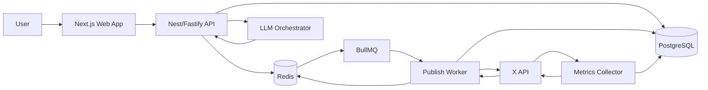
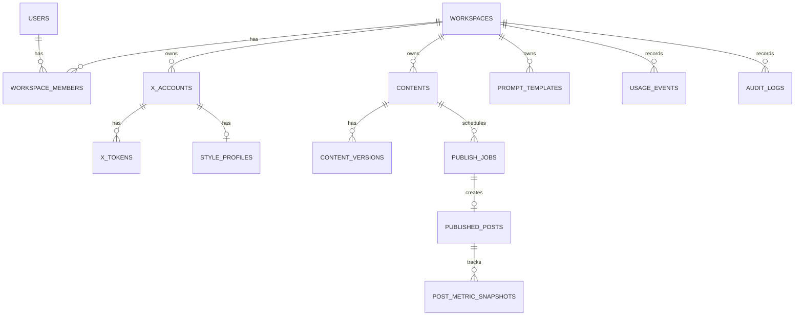

# Faz 2 — Mimari & Stack

## 1) Amaç ve Kapsam

- MVP hızını koruyan, ürünleşmeye uygun mimariyi seçmek
- AI orkestrasyonu, X API, scheduler ve analytics sınırlarını netleştirmek
- Rate-limit, maliyet ve güvenilir publish risklerini mimaride karşılamak

## 2) Mimari Kararı (ADR Özeti)

- Seçim: `Modular Monolith + Clean Architecture + ayrı worker process`
- Gerekçe:
  - Erken microservice karmaşasını önler
  - Domain modüllerini net ayırır, ileride servisleşmeyi kolaylaştırır
  - Publish/scheduler kritik yolunu web API trafiğinden izole eder
- Referans: `docs/adr/0001-mvp-mimari-ve-stack.md`

## 3) Domain Modülleri (Domain-centric)

- `auth`: uygulama auth (magic link/OAuth callback), session/identity
- `x_integration`: OAuth2 Authorization Code + PKCE, client wrapper, rate-limit state
- `style`: style profile extraction ve sürümleme
- `generation`: prompt library + LLM orchestration
- `content_library`: draft/version yönetimi
- `scheduling`: queue + publish worker + retry/backoff
- `analytics`: metrics snapshot + first-hour görünüm + alert
- `billing` (MVP-1): credits/plan sayaç altyapısı
- `audit` (MVP-1): denetlenebilir olay kayıtları

## 4) Tech Stack (Detay)

### Frontend

- Next.js (App Router) + TypeScript
- UI: Tailwind + shadcn/ui
- Data fetching/cache: TanStack Query
- Auth UI: magic link ve OAuth callback handling

### Backend

- Seçenek A (önerilen): TypeScript + NestJS (Fastify adapter)
- Seçenek B: Python + FastAPI
- AI katmanı: OpenRouter (OpenAI-compatible API), orchestration adapter ile soyutlanmış
- Not: Tek kişilik hız için TS fullstack (Next + Nest) bağlam maliyetini düşürür

### Database

- PostgreSQL
- JSONB alanları: `style_profile`, `prompt_config`, `metrics_snapshot`
- Kritik indeksler:
  - `(account_id, created_at DESC)`
  - `(x_post_id, captured_at DESC)`

### Cache

- Redis: rate-limit state, job lock/state, kısa ömürlü cache

### Queue

- BullMQ (Redis): `schedule -> publish worker -> metrics collector`

### Auth

- Uygulama auth: magic link (email) veya OAuth (Google/GitHub)
- X auth: OAuth2 Authorization Code Flow with PKCE
- Refresh senaryosu: `offline.access` ile yenileme token akışı

### Observability

- Logging: structured JSON logs (pino/winston)
- Error tracking: Sentry
- Metrics: Prometheus (opsiyonel) veya hosted alternatif
- Tracing: OpenTelemetry (opsiyonel, staging+prod)

## 5) Yüksek Seviye Sistem Akışı

## 6) Content -> Publish -> Metrics Akışı (Detay)

1. Kullanıcı Generator ekranında içerik üretir ve `contents` + `content_versions` kaydı oluşur.
2. Kullanıcı `publish now` veya `schedule` seçer, `publish_jobs` queue'ya yazılır.
3. Worker due job'u `FOR UPDATE SKIP LOCKED` ile alır.
4. Worker idempotency kontrolü yapar (`dedupe_key` benzersiz).
5. X publish çağrısı yapılır, sonuç `published_posts` tablosuna yazılır.
6. Metrics collector T+15/T+60/T+180 pencerelerinde snapshot toplar.
7. Dashboard/Analytics ekranı first-hour görünümünü snapshotlardan hesaplar.

## 7) Publish Worker Tasarımı: Idempotency + Rate-limit + Backoff

### Idempotency

- Her publish isteğinde istemci veya sunucu `dedupe_key` üretir.
- `publish_jobs(workspace_id, account_id, dedupe_key)` unique indexi zorunlu.
- Worker yeniden çalışsa bile aynı `dedupe_key` ikinci publish'e izin vermez.

### Rate-limit Yönetimi

- Endpoint + account bazlı kota state'i Redis'te: `xrl:{account_id}:{endpoint}`.
- X yanıt header'larından kalan kota/reset zamanı güncellenir.
- Kota doluysa job `retry_wait` durumuna alınır, `next_run_at = reset_at + jitter`.

### Backoff Politikası

- 429 ve geçici 5xx için exponential backoff + jitter.
- Formül: `delay = min(base * 2^attempt, cap) + random(0..jitter)`.
- Öneri: `base=5sn`, `cap=15dk`, `max_attempt=8`.
- Kalıcı 4xx/policy hatasında retry yok, `failed_permanent`.

## 8) Veri Modeli (ER)

## 9) Temel Tablolar ve İndeks Stratejisi

Temel şema dosyası:

- `db/schema_v0.sql`

İndeks prensipleri:

- Scheduler okuma yolu: `publish_jobs(next_run_at)` partial index (`queued/retry_wait`)
- Analytics okuma yolu: `post_metric_snapshots(x_post_id, captured_at desc)`
- Feed/list okuma yolu: `published_posts(account_id, created_at desc)`
- Tenant izolasyonu: kritik tablolarda `workspace_id` tabanlı composite index
- Idempotency: `uq_publish_jobs_workspace_account_dedupe`

## 10) Ortam Stratejisi (dev / staging / prod)

### dev

- Hızlı iterasyon: local compose (`web + api + worker + postgres + redis`)
- Sandbox X app ve fake adapter ile güvenli test

### staging

- Prod'e yakın config
- Release candidate testleri ve gerçek job akışı provası
- Guarded test account ile sınırlı publish

### prod

- Sınırlı izinler (least privilege)
- Güçlü secrets yönetimi
- Audit/retention policy aktif

## 11) Konfigürasyon ve Secrets

- `.env.example` repoda (dummy değerler)
- Gerçek secrets:
  - Local: `.env.local` (gitignore)
  - Staging/Prod: platform secret manager (Vercel/Fly/AWS/GCP)
- Token encryption key:
  - Tercih: KMS-backed key
  - Alternatif: app-level encryption key + düzenli rotasyon planı

## 12) Deploy Akışı (Yüksek Seviye)

- FE: Vercel -> staging/prod
- BE: Fly.io/Render/ECS -> staging/prod
- DB: managed PostgreSQL
- Migration:
  - CI'de migration plan/check
  - Deploy sonrası kontrollü migration apply

## 13) Hosting/Infra Seçenekleri

### Low Budget (önerilen başlangıç)

- Render/Railway/Fly (api+worker)
- Neon/Supabase Postgres
- Upstash Redis

### Medium Budget

- AWS ECS Fargate (api+worker)
- RDS Postgres
- ElastiCache Redis

## 14) Zaman Çizelgesi / Milestone (Gün 1-2)

### Gün 1

- ADR finalize
- Domain modülleri ve kontratlar kilitlenir
- ER diyagramı onaylanır

### Gün 2

- `db/schema_v0.sql` finalize
- Publish worker idempotency + rate-limit/backoff tasarımı onaylanır
- Staging ve secrets checklist tamamlanır

## 15) Riskler ve Mitigasyon

| Risk                                                  | Etki                | Mitigasyon                                              |
| ----------------------------------------------------- | ------------------- | ------------------------------------------------------- |
| Erken microservice parçalama                          | Hız kaybı           | Modüler monolith, servisleşmeyi ertele                  |
| X API limitleri nedeniyle scheduler güvensizliği      | Publish kaçırma     | Redis rate-limit state + retry/backoff + görünür kuyruk |
| Infra seçiminin maliyet/sürdürülebilirlik uyumsuzluğu | Operasyonel gecikme | low/medium iki yol ve geçiş kriteri                     |

## 16) Faz 2 Çıkış Kriteri (DoD)

- ADR accepted
- Akış diyagramı ve ER modeli onaylı
- DB şeması v0 migration-ready
- Worker retry/idempotency kararları test senaryolarına bağlı
- dev/staging/prod + secrets yaklaşımı dokümante
